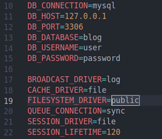
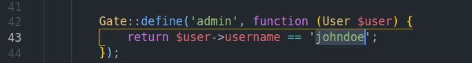
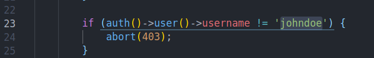
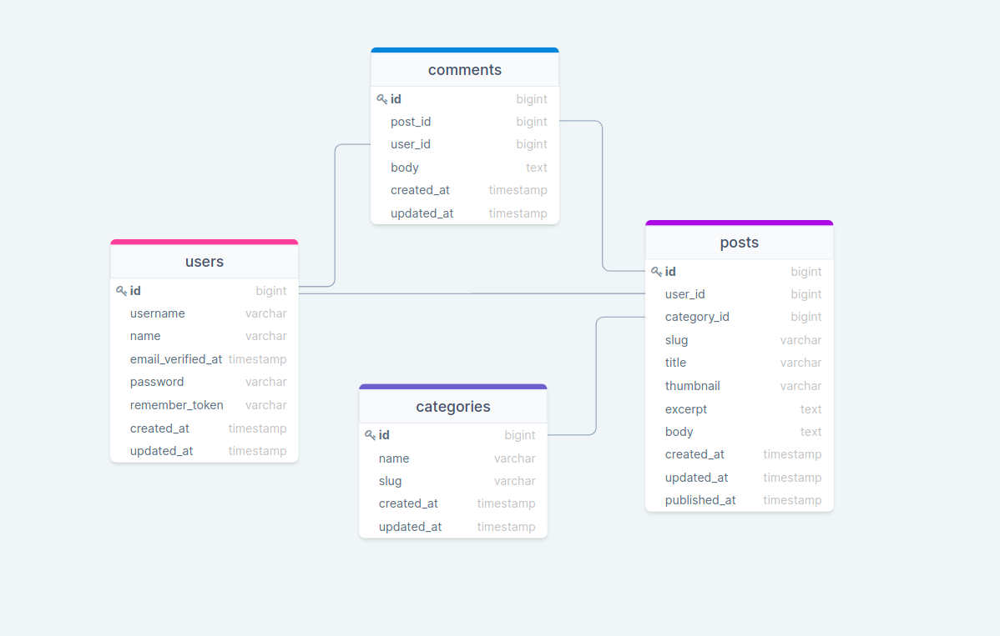

## Table of Contents

*  [ About The App.](#about)
*  [ Prerequisites. ](#pre)
*  [ Install and Run.](#iar)
*  [ Admin status. ](#admin)
*  [ Database structure.](#db)

<a name="about"></a>

## About the application

Laravel From Scratch is a blog. Where you can view posts on different topics,
with different categories and with different authors. 
Also post your opinion in the comments.

## App looks like 

---
<a name="iar"></a>

## Prerequisites
### <a  href="https://www.php.net/downloads" target="_blank">version 7.3 and up </a>  
### <a href="https://nodejs.org/en/" target="_blank">  version 14 and up </a> 
### <a href="https://www.mysql.com/downloads/" target="_blank">  version 8 and up </a> 

<a name="iar"></a>

## Install and Run

1. Downoad [ZIP](https://github.com/RedberryInternship/davitlabadze-laravel-8-from-scratch/archive/refs/heads/main.zip) or Clone: ```https://github.com/RedberryInternship/davitlabadze-laravel-8-from-scratch.git```
2. Install all dependencies using the ```composer i``` command
3. Install NPM using the ```npm i``` command
4. Run ```npm run watch``` or ```npm run dev```
5. Create env file Run the command ```cp .env.example .env```
6. Run ```php artisan key:generate```
7. Enter the correction of your database name in the ```.env``` file, etc. ```FILESYSTEM_DRIVER=public``` . 


   
8. Create a place to store images ```php artisan storage:link```
9.  Run the command ```php artisan migrate```
10.  If you want fake post, Run the command ```php artisan db:seed```
11.  Run the command ```php artisan serve```

<a name="admin"></a>

## Admin status
#### How to get admin status:
    Open: app/Providers/AppServiceProvider.php
    On line 43 Change the username of the user you want to be an admin

#### How to get permission to enter the route:
    Open: app/Middleware/MustBeAdminsitrator.php
    On line 23 Change the username you want to get permission to enter the route


<a name="db"></a>

## Database structure


## Resources

* [DrawSQL](https://drawsql.app/redberry-14/diagrams/scratch)
